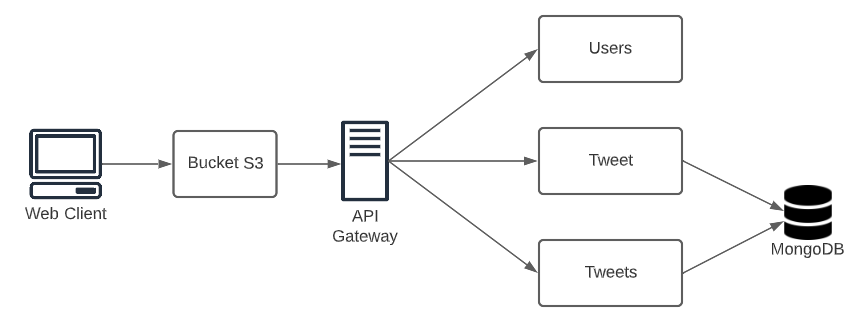

## Escuela Colombiana de Ingeniería

# MICROSERVICIOS CON QUARKUS

En grupos de máximo 3.

1. Diseñe una API y cree un monolito Quarkus que permita a los usuarios hacer posts de 140 caracteres e ir registrándolos en un stream único de posts (a la Twitter). Piense en tres entidades Usuario, hilo(stream), posts.

2. Cree unA aplicación JS para usar el servicio. Despliegue la aplicación en S3. Asegúrese que esté disponible sobre internet.

3. Pruebe la aplicación Web.

4. Agregue seguridad usando JWT con el servicio cognito de AWS.

5. Separe el monolito en tres microservicios independientes.

6. Despliegue el servicio en AWS con EC2 y realice pruebas (Puede usar docker o 3 máquinas AWS)

7. Entregue el código desarrollado en Github, un reporte de la arquitectura, un reporte de las pruebas, y un video con el experimento funcionando y bien configurado (Todo en el README).

## Clonación del proyecto

Para descargar este proyecto, debe ejecutar el siguiente comando para descargar el proyecto:

```
https://github.com/Andresariz88/AREP-Taller08.git
```

### Prerrequisitos

Para hacer uso de esta aplicación debe tener conocimientos de:
+ Java - Lenguaje de programación orientado a objetos.
+ Quarkus - Ejecución eficiente de aplicaciones Java en contenedores Kubernetes.
+ JWT - Decodificación, verificación y generación de JSON Web Tokens.
+ Maven - Herramienta para automatizar la gestión y construcción de proyectos Java. 
+ AWS - Plataforma de computación en la nube.

## Descripción del proyecto

El proyecto está diseñado como se ve en la imagen de abajo donde un browser hace peticiones a un API gateway el cual es el encargado de realizar un GET de los últimos 10 tweets y dos POST, uno para crear un tweet y otro para el login del usuario.



### Instancias AWS

1. Instalar Java, en este caso Java 8 con el siguiente comando:

```
sudo yum install java-11-amazon-corretto-devel

java -version
```

2. A través de una conexión sftp, subir el proyecto con los archivos de mvn.

3. Instalar Quarkus ejecutando los siguientes comandos:

```
curl -Ls https://sh.jbang.dev/ | bash -s - trust add https://repo1.maven.org/maven2/io/quarkus/quarkus-cli/

curl -Ls https://sh.jbang.dev/ | bash -s - app install --fresh --force quarkus@quarkusio
```

4. Reiniciar la instancia.

5. Ubicarse en el directorio del proyecto y ejecutar el siguiente comando:

```
chmod +x /home/ec2-user/AREP-Taller08/mvnw
```

6. Finalmente, ejecutar el proyecto con el siguiente comando:

```
quarkus dev
```

No olvidar abrir los puertos necesarios para que el proyecto pueda ser ejecutado correctamente.

## Test


## Construido con

+ [Maven](https://maven.apache.org/) - Dependency Management
+ [Quarkus](https://es.quarkus.io) - Supersonic Subatomic Java
+ [AWS](https://aws.amazon.com/es/) - Cloud Platform
+ [JWT](https://jwt.io) - JSON Web Tokens

## Versión

1.0

## Autores

Andres Felipe Ariza Pardo

Esteban Camilo Archila Bastidas

Juan Pablo Sánchez Bermúdez
