## Escuela Colombiana de Ingeniería

# MICROSERVICIOS CON QUARKUS

En grupos de máximo 3.

1. Diseñe una API y cree un monolito Quarkus que permita a los usuarios hacer posts de 140 caracteres e ir registrándolos en un stream único de posts (a la Twitter). Piense en tres entidades Usuario, hilo(stream), posts.

2. Cree unA aplicación JS para usar el servicio. Despliegue la aplicación en S3. Asegúrese que esté disponible sobre internet.

3. Pruebe la aplicación Web.

4. Agregue seguridad usando JWT con el servicio cognito de AWS.

5. Separe el monolito en tres microservicios independientes.

6. Despliegue el servicio en AWS con EC2 y realice pruebas (Puede usar docker o 3 máquinas AWS)

7. Entregue el código desarrollado en Github, un reporte de la arquitectura, un reporte de las pruebas, y un video con el experimento funcionando y bien configurado (Todo en el README).

## Clonación del proyecto

Para descargar este proyecto, debe ejecutar el siguiente comando para descargar el proyecto:

```
https://github.com/Andresariz88/AREP-Taller08.git
```

### Prerrequisitos

Para hacer uso de esta aplicación debe tener conocimientos de:
+ Java - Lenguaje de programación orientado a objetos.
+ Quarkus - Ejecución eficiente de aplicaciones Java en contenedores Kubernetes.
+ JWT - Decodificación, verificación y generación de JSON Web Tokens.
+ Maven - Herramienta para automatizar la gestión y construcción de proyectos Java. 
+ AWS - Plataforma de computación en la nube.

## Descripción del proyecto

El proyecto está diseñado como se ve en la imagen de abajo donde un browser hace peticiones a un API gateway el cual es el encargado de realizar un GET de los últimos 10 tweets y dos POST, uno para crear un tweet y otro para el login del usuario.


### Instancias AWS

1. Instalar Java, en este caso Java 11 con el siguiente comando:

```
sudo yum install java-11-amazon-corretto-devel

java -version
```

2. A través de una conexión sftp, subir el proyecto con los archivos de mvn y la configuración del proyecto en el archivo application.properties.

3. Instalar Quarkus ejecutando los siguientes comandos:

```
curl -Ls https://sh.jbang.dev/ | bash -s - trust add https://repo1.maven.org/maven2/io/quarkus/quarkus-cli/

curl -Ls https://sh.jbang.dev/ | bash -s - app install --fresh --force quarkus@quarkusio
```

4. Reiniciar la instancia.

5. Ubicarse en el directorio del proyecto y ejecutar el siguiente comando:

```
chmod +x /home/ec2-user/AREP-Taller08/mvnw
```

6. Finalmente, ejecutar el proyecto con el siguiente comando:

```
quarkus dev
```

No olvidar abrir los puertos necesarios para que el proyecto pueda ser ejecutado correctamente.

### Bucket S3

Una vez se tengan los clientes JS, se deberá crear un bucket S3 en donde se subirán los archivos html y js.

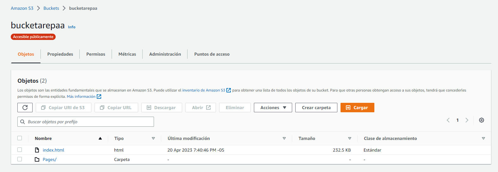

Este servicio deberá correr por el protocolo https para que pueda ser utilizado en Cognito.

### AWS Cognito

Para hacer uso del servicio de Amazon cognito, se debe crear un grupo de usuarios donde:

1. Configurar la experiencia de inicio de sesión.

    Establecer como opciones de inicio de sesión el nombre de usuario y el correo electrónico.

    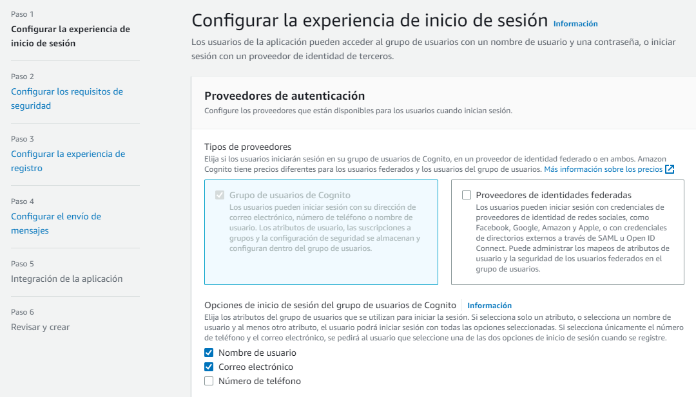

2. Configurar los requisitos de seguridad.

    Seleccionar Valores predeterminados de Cognito y en la Autenticación multifactor, seleccionar sin MFA.

    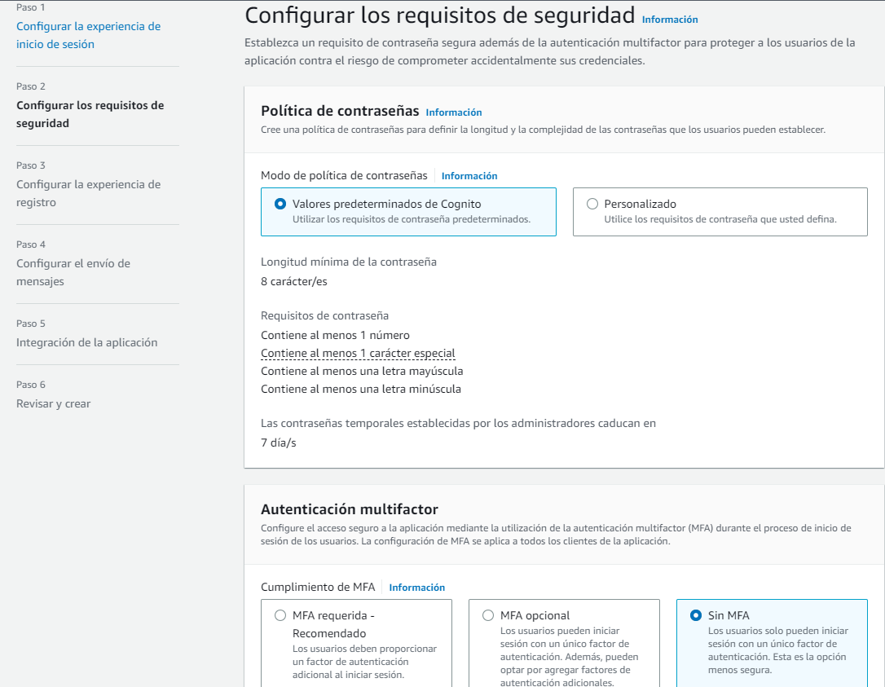

3. Configurar la experiencia de registro.

    Elegir la configuración que trae por defecto.

4. Configurar el envío de mensajes.

    Seleccionar la opción de enviar un correo electrónico con Cognito

    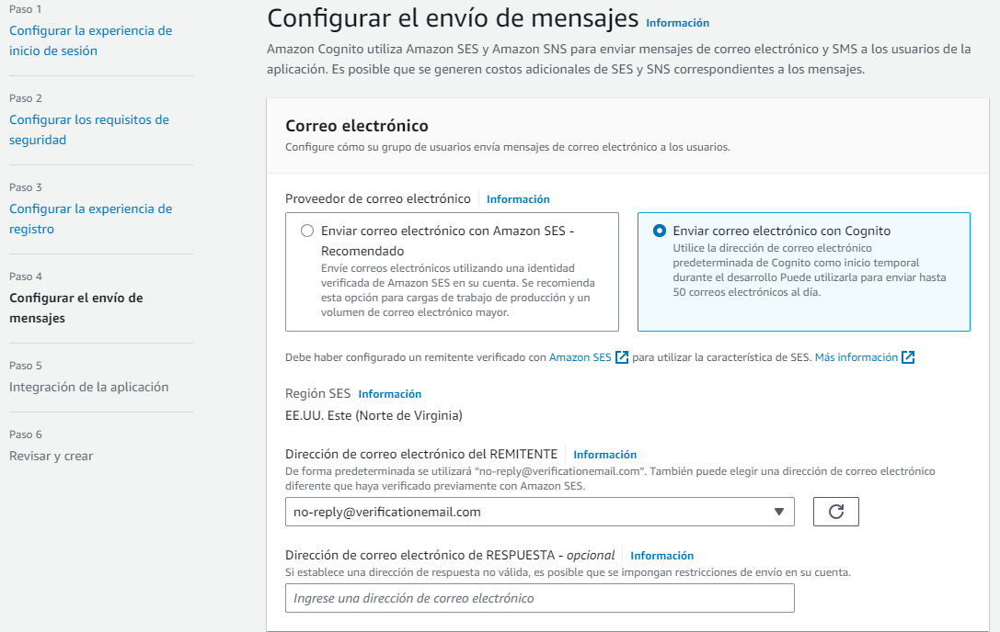

5. Integración de la aplicación.

    Proporcionar un nombre al grupo de usuarios.

    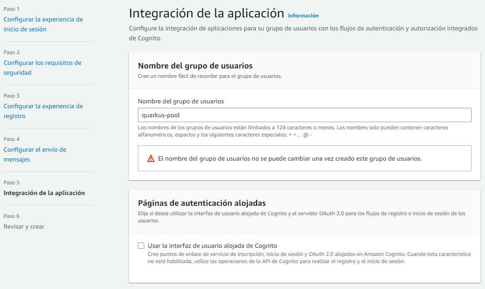

    Y finalmente crear un cliente público y no generar un secreto de cliente.

    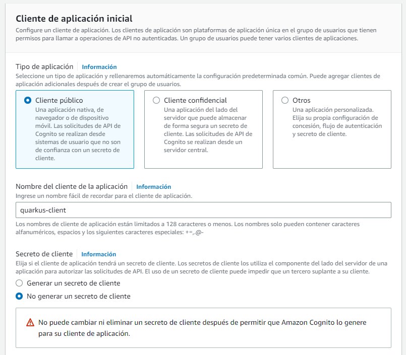

Una vez se completen estos pasos, dirigirse al grupo de usuarios creado y en Integración de aplicaciones buscar el cliente público que se creó. En la sección de interfaz de usuario alojada, se debe fijar la url del servicio que se generó con el bucket S3.

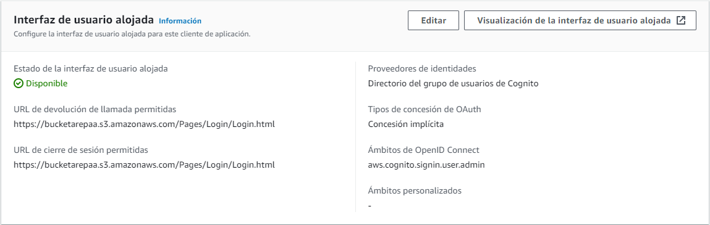

## Test

Al hacer clic en Visualización de la interfaz de usuario alojada, nos redirigirá a un login que nos ofrece el servicio de Amazon cognito.

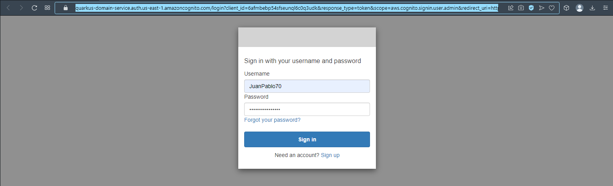

Al iniciar sesión, este nos dará acceso al proyecto realizado con Quarkus.

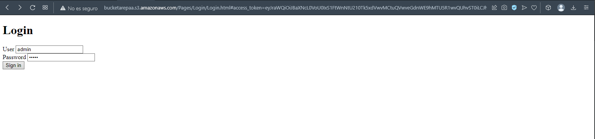

Se puede corroborar que se creó un token con el usuario registrado JuanPablo70 por medio de la página de JWT.

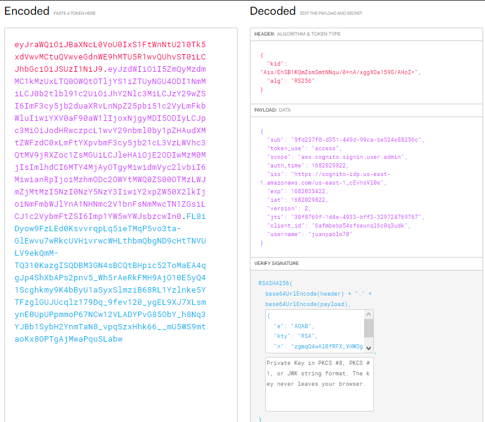

Siguiendo con el ejercicio, una vez un usuario haya iniciado sesión, este puede ver los últimos tweets y también agregar uno nuevo.

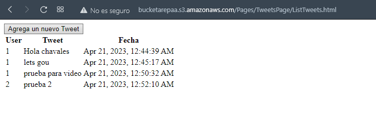

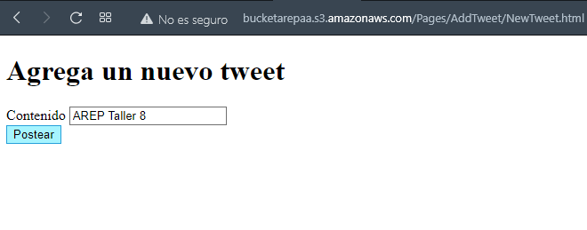

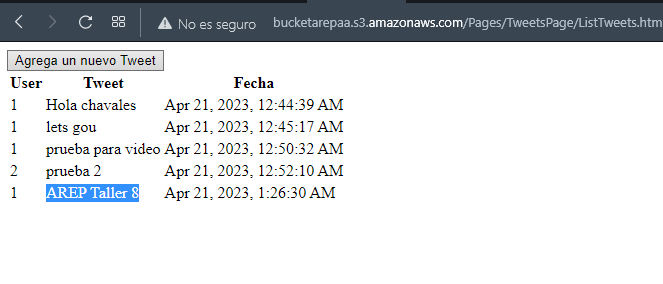

## Video

[Video](https://drive.google.com/file/d/11uJqFPIto7OvAT0U7vEYLRIxs9acssCQ/view?usp=share_link)

## Construido con

+ [Maven](https://maven.apache.org/) - Dependency Management
+ [Quarkus](https://es.quarkus.io) - Supersonic Subatomic Java
+ [AWS](https://aws.amazon.com/es/) - Cloud Platform
+ [JWT](https://jwt.io) - JSON Web Tokens

## Versión

1.0

## Autores

Andres Felipe Ariza Pardo

Esteban Camilo Archila Bastidas

Juan Pablo Sánchez Bermúdez
